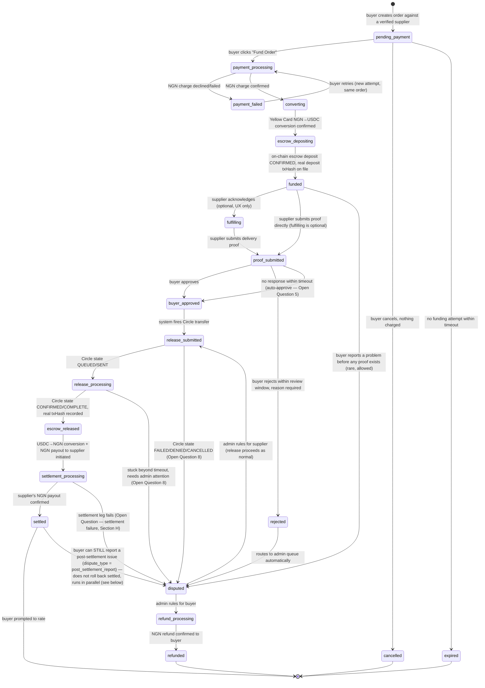

# Marketplace / Payments Redesign — Design Document

Status: **draft, awaiting approval. No code, migrations, or schema changes
have been made.** Per your instructions and CLAUDE.md's own rule ("if a
task touches escrow, KYC, or payouts, stop and flag it for human review
rather than guessing at the rules"), this is the thing to review, mark up,
and send back.

Scope note: this brief is bigger than the prompt pack's Stage 6
("escrow lifecycle"). It also pulls in Stage 7 (verification — but
redefined as one-time KYB, not per-order field audits), Stage 8
(disputes), and adds two things nothing in the current app or the pack
touches at all: NGN-denominated payment via Yellow Card, and on-chain
ratings. I've treated this document as superseding
[`docs/stage6-escrow-design.md`](stage6-escrow-design.md) rather than
sitting alongside it — Section A explains why the two can't coexist.

---

## 0. Read this first — a pivot, not an extension

Before the schema and state machine, one thing needs to be explicit
because it changes what almost every other section means.

**The current app's core mechanic is a field agent ("sourcer") who
physically visits a supplier on the buyer's behalf, on every single
transaction, and gets paid a commission for doing so.** The supplier
never has an account, never logs in, never gets paid directly — they're
a name and a CAC number on someone else's audit report.

**Your brief removes that mechanic entirely.** Suppliers are verified
once, become first-class platform accounts, and are the ones who
fulfill orders, submit delivery proof, and receive settlement. There is
no field agent anywhere in `Buyer → Supplier → Order → Checkout →
Supplier Verification → Delivery → Proof → Buyer Approval → Escrow
Release → Settlement → Rating`.

That means this isn't "rename sourcer to supplier." It's:

| | Today | Proposed |
|---|---|---|
| Who gets verified | The supplier, informally, by whoever the sourcer happened to visit | The supplier, formally, as a KYB'd platform account |
| Who fulfills the order | The sourcer (buys/collects on buyer's behalf) | The supplier, directly |
| Who gets paid from escrow | The sourcer (a "sourcing fee") | The supplier (the order value) |
| What "claim a request" means | A sourcer picks up someone else's job and names a fee | Doesn't exist — buyer orders directly from a verified supplier |
| Verification cost | Per transaction (a site visit every time) | Once, amortized over 90 days / 20 orders |

I'm confident this reading is correct — it's what the flow diagram and
Section 2 ("we are removing the requirement for a field agent to verify
a supplier for every transaction") both say — but it's the single
highest-leverage decision in this whole document, everything downstream
inherits it, and it retires a role the app is currently built around.
It's **Open Question #1**. Everything below assumes it's confirmed;
flag now if it isn't.

One consequence worth naming: the `sourcer` role, `sourcer_profiles`,
`sourcer_applications`, `/sourcer`, and every "claim/fee/audit" code path
in `app/api/escrow/route.ts` don't get a light rename — they get replaced
by a differently-shaped `supplier` role and a differently-shaped order
flow. Reuse is real (see Section A) but it's at the level of "same
authz pattern, same compare-and-swap discipline, same admin-approval
gate" — not "same table with different column names."

---

## A. Current Architecture — what exists, what's reusable, what isn't

**Stack** (confirmed from `package.json`, `README.md`, `CLAUDE.md`):
Next.js 16 App Router + TypeScript strict + Supabase (Postgres,
service-role client, RLS as a default-deny backstop, not the real
boundary) + Privy for identity + this app's own signed session cookie
+ Circle developer-controlled wallets for the one on-chain leg that
exists today (sourcer payout) + wagmi/viem for a separate buyer-side
direct wallet transfer path.

**What's genuinely reusable, as-is or with light changes:**

- **`lib/authz.ts`** — `requireSession()`/`requireRole()`/`logAudit()`.
  The choke point every protected route goes through; role is always
  re-derived from the DB, never trusted from the client or the JWT. This
  pattern is exactly right for buyer/supplier/admin too. No changes
  needed to the mechanism, just the role enum's values.
- **`lib/requestStateMachine.ts`**'s *shape* — a single source of truth
  for legal transitions (`assertTransition(from, to)`), enforced on top
  of (not instead of) a DB-level compare-and-swap. This pattern is the
  right foundation for the richer order state machine in Section D. The
  content (today's 8 states) doesn't carry over.
- **The admin-approval pattern** — `sourcer_applications` /
  `PATCH /api/admin/sourcer-applications/[id]` / the `ApplicationCard`
  UI in `AdminDashboard.tsx`. Structurally this is already "someone
  applies, an admin reviews with notes, a compare-and-swap prevents
  double-review, approval flips a role and is audit-logged." That's
  supplier verification. See Section F for what changes in the form
  fields and what the approval action now needs to *create* (a
  `supplier_profiles` row with verification metadata, not just a role
  flip).
- **`lib/money.ts`** — integer-minor-units discipline, one conversion
  point. Extend, don't replace: needs a real multi-currency-aware
  `PLATFORM_FEE` (today's flat $5.00 constant) and NGN formatting is
  already there (`Currency = "USD" | "NGN"`).
- **RLS posture** — enabled everywhere, zero policies, service-role
  client bypasses it by design, real visibility enforced in the route
  layer. Keep this; it's a sound default-deny backstop.
- **The compare-and-swap discipline** in every write
  (`.eq("status", from)` alongside `assertTransition`) — keep this
  exactly. It's the actual race-condition defense; the state machine
  check is the readable error message on top of it.
- **Design system** (`components/ui/*`, `/design-system`) — no product
  logic here, reuse wholesale.

**What's confirmed broken or unsafe, not just outdated** (per your
instruction to identify this before proposing changes):

1. **`app/api/escrow/route.ts`'s `releaseEscrow` marks the request
   `escrow_released` in the same request that calls Circle's
   `createTransaction`, before any confirmation exists.** This is the
   headline bug from your brief, and I verified it directly against the
   installed SDK rather than trusting the existing code comments (see
   Section D.0). It's real, it's still there, and it's the reason the
   whole state machine needs to change, not just get relabeled.
2. **The same function also has a live type bug**, not just an
   async-timing bug: it calls `client.createTransaction({ amounts: [...] })`
   (plural) cast through `as unknown as Parameters<...>[0]` to bypass
   the type checker. The real SDK input type (`CreateTransferTransactionInput`,
   confirmed in `node_modules/@circle-fin/developer-controlled-wallets/dist/types/developer-controlled-wallets.d.ts:241-267`)
   wants `amount: string[]` — singular field name, array value. Because
   of the `as unknown` cast, this has never been a type error and would
   silently send a malformed request if it ever ran for real. On top of
   that, its response type has no `txHash` field at all (see below), so
   even fixing the field name wouldn't fix the underlying problem — item
   1 is the real defect, this is a second, independent one riding on top
   of it.
3. **No double-entry ledger.** `escrow_transactions` is an append-only
   log with no debit/credit shape and nothing that enforces "money in =
   money out."
4. **No dispute path exists.** `disputes` is a schema-only table; no
   route reads or writes it. A buyer who wants to flag a problem — before
   *or* after approval — has no mechanism today, not even the "reject an
   audit" version your brief distinguishes from a post-approval dispute.
5. **Suppliers have no accounts, wallets, or auth today.** `suppliers`
   is a passive table (`name`, `cac_registration_number`, `location`,
   `verified boolean`) referenced from `audit_reports.supplier_id` —
   never a `users` row, never something that logs in or gets paid. This
   is the biggest structural gap the pivot in Section 0 has to close.
6. **The handshake code is hardcoded `"1234"`** in `submitAudit`, and
   photo evidence isn't checked against anything. Moot for this stage
   specifically *because* per-order field verification is going away
   (Open Question #1) — flagging so it's a deliberate "no longer
   applicable" rather than a silently dropped finding.

---

## B. Proposed Architecture

```
┌─────────────────────────────────────────────────────────────────────┐
│                              Client (Next.js)                        │
│   Buyer dashboard │ Supplier dashboard │ Admin dashboard             │
└───────────────────────────────┬───────────────────────────────────--┘
                                 │ HTTPS, session cookie
┌───────────────────────────────▼───────────────────────────────────--┐
│                    Application layer (this side, my scope)           │
│  - requireSession / requireRole (lib/authz.ts, unchanged pattern)    │
│  - Order state machine (lib/orderStateMachine.ts)                    │
│  - Supplier verification: status + live expiry check                 │
│  - Ledger writer (double-entry, invariant-checked)                   │
│  - Dispute + rating records                                          │
│  - PAYMENT INTEGRATION BOUNDARY (Section E) ─────────────┐           │
└───────────────────────────────┬───────────────────────────────────--┘│
                                 │ Supabase (service-role)               │
┌───────────────────────────────▼───────────────────────────────────--┐│
│                         Postgres (Section C)                         ││
└───────────────────────────────────────────────────────────────────--┘│
                                                                         │
┌────────────────────────────────────────────────────────────────────-▼┐
│              Payment / blockchain layer (your scope, Section 9)       │
│  Yellow Card (NGN⇄USDC) │ Circle developer-controlled wallets (USDC   │
│  escrow, transfers) │ On-chain ratings write │ Smart contracts        │
└─────────────────────────────────────────────────────────────────────-┘
```

The one architectural rule this diagram is trying to make unavoidable:
**the application layer never calls Yellow Card or Circle directly for
money movement.** It calls a small set of functions you own (Section E),
and reacts to status changes those functions report back — by polling,
webhook, or however you implement confirmation. This is what makes
incremental integration possible (your stated goal) — I can build and
test the entire order/ledger/dispute/rating flow against a stub
implementation of that boundary before your real integration exists.

---

## C. Database Schema

Additive where possible; a few existing tables are superseded outright
per Section 0's pivot (called out explicitly, not silently dropped).

### C.1 Roles & identity — mostly unchanged

`users` keeps its shape (`role text check (role in ('buyer','supplier','admin'))`
— renamed from `sourcer`). `lib/authz.ts`, `lib/session.ts`,
`lib/privyServer.ts` need no structural changes, just the role enum value.

### C.2 Suppliers — the structural gap this stage actually closes

```sql
-- Supersedes today's passive `suppliers` table AND `sourcer_profiles`.
-- A supplier IS a users row (role = 'supplier') with a profile attached,
-- the same pattern sourcer_profiles already used — just now the
-- business identity, not the field agent's.
create table supplier_profiles (
  id bigint generated always as identity primary key,
  user_id bigint not null references users(id),
  business_name text not null,
  cac_registration_number text,          -- "the business is real"
  business_location text not null,        -- "the supplier's location"
  what_they_sell text not null,           -- free text; materials_offered below is the structured version
  phone text,
  address text,

  -- Verification lifecycle — see Section D.2 for why this is computed
  -- live at order-funding time, not trusted as a cached boolean alone.
  verification_status text not null default 'unverified'
    check (verification_status in ('unverified', 'pending', 'verified', 'expired')),
  verified_at timestamptz,
  verified_by bigint references users(id),
  verification_expires_at timestamptz,     -- verified_at + 90 days, set at approval time
  orders_since_verification integer not null default 0,  -- resets to 0 at each (re)verification

  wallet_address text,                     -- Circle developer-controlled wallet, your side provisions
  wallet_id text,

  created_at timestamptz not null default now(),
  updated_at timestamptz not null default now(),
  deleted_at timestamptz
);

create unique index idx_supplier_profiles_user_id on supplier_profiles (user_id) where deleted_at is null;
create index idx_supplier_profiles_status on supplier_profiles (verification_status);

-- What a verified supplier is understood to produce/sell, structured
-- (in addition to the free-text what_they_sell above) — lets a buyer
-- filter suppliers by material, matches today's materials catalog.
create table supplier_materials (
  supplier_id bigint not null references supplier_profiles(id),
  material_id bigint not null references materials(id),
  primary key (supplier_id, material_id)
);
```

```sql
-- Repurposed from sourcer_applications — same shape, different fields
-- and different consequence on approval (see Section F).
create table supplier_verification_applications (
  id bigint generated always as identity primary key,
  user_id bigint not null references users(id),
  status text not null default 'pending' check (status in ('pending', 'approved', 'rejected')),
  business_name text not null,
  cac_registration_number text,
  business_location text not null,
  what_they_sell text not null,
  supporting_document_url text,           -- CAC certificate, utility bill, etc. — evidence for "the business is real"
  reviewed_by bigint references users(id),
  reviewed_at timestamptz,
  review_notes text,
  created_at timestamptz not null default now(),
  updated_at timestamptz not null default now()
);

create unique index idx_supplier_verif_apps_one_pending_per_user
  on supplier_verification_applications (user_id) where status = 'pending';
```

A re-verification (after expiry) is a new row in this same table, not a
different flow — same admin queue, same UI.

### C.3 Orders — supersedes `sourcing_requests`

```sql
create type order_status as enum (
  'pending_payment',        -- created, buyer hasn't funded yet
  'payment_processing',     -- NGN charge submitted, awaiting confirmation (your side)
  'converting',             -- NGN confirmed, Yellow Card NGN→USDC conversion in flight
  'escrow_depositing',      -- USDC transfer to escrow wallet submitted, unconfirmed
  'funded',                 -- escrow deposit CONFIRMED on-chain — the real "paid" state
  'fulfilling',              -- supplier acknowledged, preparing/dispatching (optional visibility state)
  'proof_submitted',        -- supplier submitted delivery proof
  'buyer_approved',         -- buyer approved — INTENT only, no funds have moved yet
  'release_submitted',      -- release transfer submitted to Circle
  'release_processing',     -- Circle transfer state is QUEUED/SENT, not yet confirmed
  'escrow_released',        -- Circle transfer state CONFIRMED/COMPLETE, real txHash on file
  'settlement_processing',  -- USDC→NGN conversion + NGN payout to supplier in flight
  'settled',                -- supplier has received NGN — order fully complete
  'rejected',               -- buyer rejected the proof (pre-approval) — routes to disputed
  'disputed',                -- open dispute, funds frozen pending admin ruling
  'refund_processing',      -- admin ruled for buyer, NGN refund in flight
  'refunded',
  'cancelled',               -- buyer cancels before funding
  'payment_failed',
  'expired'
);

create table orders (
  id bigint generated always as identity primary key,
  order_code text not null,               -- ORD-XXXXXX, buyer-facing
  status order_status not null default 'pending_payment',

  buyer_id bigint not null references users(id),
  supplier_id bigint not null references supplier_profiles(id),
  material_id bigint references materials(id),

  title text not null,
  description text,
  quantity text,
  delivery_location text not null,

  -- Buyer-facing amount, always NGN. USDC amounts are computed at
  -- funding/settlement time from whatever rate Yellow Card gives you —
  -- see Open Question on FX risk (Section J).
  amount_minor bigint not null check (amount_minor > 0),
  currency text not null default 'NGN' check (currency = 'NGN'),
  platform_fee_minor bigint not null,

  -- Snapshot of the supplier's verification at order-creation time —
  -- audit trail, NOT the authorization check (that's always live, see D.2).
  supplier_verified_at_order_time timestamptz,

  created_at timestamptz not null default now(),
  updated_at timestamptz not null default now(),
  deleted_at timestamptz
);

create unique index idx_orders_order_code on orders (order_code);
create index idx_orders_status on orders (status);
create index idx_orders_buyer_id on orders (buyer_id);
create index idx_orders_supplier_id on orders (supplier_id);
```

### C.4 Payment events — the fine-grained async trail

Neither the funding leg (NGN → USDC → escrow) nor the release leg
(approval → transfer → confirmation) is a single atomic step. Both need
their own event log, distinct from `orders.status` (which is the
coarse, buyer/supplier-facing summary) and from `ledger_entries` (which
is money-accounting, not process-tracking).

```sql
create table payment_events (
  id bigint generated always as identity primary key,
  order_id bigint not null references orders(id),
  leg text not null check (leg in ('funding', 'release', 'settlement', 'refund')),
  provider text not null check (provider in ('yellow_card', 'circle')),
  provider_reference text,                -- Yellow Card's ref / Circle's transaction id
  event_type text not null,               -- e.g. 'ngn_charge_created', 'ngn_charge_confirmed',
                                            -- 'conversion_submitted', 'conversion_confirmed',
                                            -- 'transfer_submitted', 'transfer_state_changed', 'tx_hash_recorded'
  provider_state text,                    -- raw state string from the provider, unmapped
  tx_hash text,                            -- only ever set once, from a real getTransaction() lookup — never fabricated
  amount_minor bigint,
  currency text,
  raw_payload jsonb,                       -- full webhook/poll response, for debugging & reconciliation
  created_at timestamptz not null default now()
);

create index idx_payment_events_order on payment_events (order_id);
create index idx_payment_events_provider_ref on payment_events (provider_reference);
```

### C.5 Delivery proof

```sql
create table delivery_proofs (
  id bigint generated always as identity primary key,
  order_id bigint not null references orders(id),
  supplier_id bigint not null references supplier_profiles(id),
  photo_urls text[] not null default '{}',
  receipt_url text,
  notes text,
  submitted_at timestamptz not null default now()
);
```

### C.6 Ledger — double-entry, invariant-checked

```sql
create table ledger_entries (
  id bigint generated always as identity primary key,
  ledger_transaction_id uuid not null,   -- groups entries that must net to zero, PER CURRENCY
  order_id bigint not null references orders(id),
  account text not null check (account in (
    'ESCROW_WALLET_USDC', 'PLATFORM_REVENUE', 'SUPPLIER_PAYABLE',
    'EXTERNAL_NGN_BUYER', 'EXTERNAL_NGN_SUPPLIER', 'FX_CLEARING'
  )),
  account_ref bigint references users(id),   -- set for SUPPLIER_PAYABLE only
  direction text not null check (direction in ('debit', 'credit')),
  amount_minor bigint not null check (amount_minor > 0),
  currency text not null check (currency in ('NGN', 'USDC')),
  created_at timestamptz not null default now()
);

create index idx_ledger_txn on ledger_entries (ledger_transaction_id);
create index idx_ledger_order on ledger_entries (order_id);
```

**Why `FX_CLEARING` and per-currency balancing, not one blended
ledger:** a single order's money touches two currencies (NGN in from
the buyer, USDC held in escrow, NGN out to the supplier) at exchange
rates that can differ between funding and settlement. Trying to force
NGN debits against USDC credits into one "balanced" transaction hides
that fact instead of accounting for it. Instead: every NGN leg balances
against NGN legs, every USDC leg balances against USDC legs, and
`FX_CLEARING` is the contra-account on both sides of each conversion —
so the *invariant* (debits = credits, same currency, same
`ledger_transaction_id`) stays simple and mechanically checkable, and
the FX spread/timing risk becomes something you can literally query
(`FX_CLEARING`'s running balance) instead of something buried in
rounding. See Open Question 7 for who owns that spread.

**Invariant + enforcement, same as the existing stage6 draft:** a
Postgres trigger rejects an unbalanced insert (same `ledger_transaction_id`
+ `currency` must net to zero) at write time, not just on a later audit
query. `tests/ledger.test.ts` asserts this holds through every scenario
in Section I.

### C.7 Disputes — extending the schema-only table that exists today

```sql
create table disputes (
  id bigint generated always as identity primary key,
  order_id bigint not null references orders(id),
  raised_by bigint not null references users(id),
  dispute_type text not null check (dispute_type in ('pre_approval_rejection', 'post_settlement_report')),
  category text not null check (category in (
    'item_not_as_described', 'item_not_delivered', 'quality_issue',
    'wrong_quantity', 'damaged_in_transit', 'other'
  )),
  description text,
  evidence_urls text[] not null default '{}',
  status text not null default 'open'
    check (status in ('open', 'under_review', 'resolved_buyer', 'resolved_supplier', 'resolved_split')),
  resolution_notes text,
  resolved_by bigint references users(id),
  resolved_at timestamptz,
  created_at timestamptz not null default now(),
  updated_at timestamptz not null default now(),
  deleted_at timestamptz
);

create index idx_disputes_order on disputes (order_id);
create index idx_disputes_status on disputes (status);

-- Every state change, every ruling, every admin note — a dispute
-- without this isn't auditable.
create table dispute_events (
  id bigint generated always as identity primary key,
  dispute_id bigint not null references disputes(id),
  actor_id bigint references users(id),
  event_type text not null,     -- 'opened', 'evidence_added', 'status_changed', 'resolved'
  details jsonb,
  created_at timestamptz not null default now()
);
```

`dispute_type` is exactly your instruction to "clearly distinguish
normal transaction completion from a post-transaction issue": a
`pre_approval_rejection` is the buyer declining the proof before any
release happens (money never left escrow — the order's own state
machine handles it, see D.1); a `post_settlement_report` is what
Section 5 of your brief asks for — a mechanism after release/settlement
where none exists today. Both land in the same `disputes` table because
admin needs one queue, but the type tells them (and any future refund
logic) which situation they're in.

### C.8 Ratings — on-chain source of truth, DB cache for fast reads

```sql
create table ratings (
  id bigint generated always as identity primary key,
  order_id bigint not null references orders(id),
  buyer_id bigint not null references users(id),
  supplier_id bigint not null references supplier_profiles(id),
  score smallint not null check (score between 1 and 5),
  comment text,

  -- The verifiability requirement: this row is a CACHE of what's
  -- on-chain, not the source of truth. on_chain_tx_hash is how anyone
  -- (including us) can independently confirm this row hasn't been
  -- altered after the fact.
  on_chain_tx_hash text,
  on_chain_confirmed_at timestamptz,

  created_at timestamptz not null default now()
);

create unique index idx_ratings_one_per_order on ratings (order_id);
create index idx_ratings_supplier on ratings (supplier_id);
```

Aggregate rating is a query over this table (`avg(score) where
supplier_id = ... and on_chain_confirmed_at is not null` — only counting
rows actually confirmed on-chain, so a row stuck in "submitted but not
yet written on-chain" can't inflate a supplier's number before it's
verifiable). A periodic reconciliation job re-reads the on-chain
registry and flags any DB row that doesn't match — same pattern as the
escrow wallet balance reconciliation the existing stage6 draft already
called out as a real, separate piece of work.

### C.9 What gets retired

`sourcing_requests`, `sourcer_profiles`, `sourcer_applications`,
`audit_reports`, `suppliers` (the old passive version) — superseded by
the above, not extended. `escrow_transactions` stays as-is for
historical rows if this is a real production DB migration (vs. the
brand-new-project path, which just never creates it). Full migration
plan is implementation-stage work, not this document's job, but it's
worth flagging now: **this is not an additive migration** the way
Stage 5's was. It's a genuine schema replacement for the request/order
core, which is a bigger, riskier migration than anything the app has
done so far — another reason Open Question #1 needs to be locked before
any SQL gets written.

---

## D. Transaction / Order State Machine

### D.0 The Circle finding, verified against the actual installed SDK

I checked this directly in `node_modules/@circle-fin/developer-controlled-wallets`
rather than trusting the existing code comments or docs:

- `client.createTransaction(input)` types its input as
  `CreateTransferTransactionInput` (`developer-controlled-wallets.d.ts:241`):
  `{ amount: string[], destinationAddress, walletId, fee, refId?, ... } & WithIdempotencyKey`.
  **`amount`, singular field name, array value.** The current code sends
  `amounts` (plural) — confirmed still present and still wrong.
- Its response type, `CreateTransferTransactionForDeveloperResponseData`
  (`clients/developer-controlled-wallets.d.ts:601-614`), is **exactly
  `{ id: string; state: TransactionState }`. No `txHash` field exists on
  this type at all** — it's not that the field is sometimes empty, the
  type doesn't have it, so the current code's `(txResponse.data as
  {txHash?:string}).txHash` is reading a field that can't exist on a
  real response.
- `TransactionState` (`clients/developer-controlled-wallets.d.ts:577-588`):
  `INITIATED | PENDING_RISK_SCREENING | QUEUED | SENT | CONFIRMED |
  COMPLETE | CANCELLED | DENIED | FAILED`.
- The real `txHash` only appears on the full `Transaction` object
  (`clients/developer-controlled-wallets.d.ts:2316-2478`, `'txHash'?: string`),
  fetched later via `client.getTransaction({ id })` — a separate,
  subsequent call, after the transfer has actually progressed.
- `idempotencyKey` (`clients/core.d.ts:284-292`) is optional at the SDK
  level — Circle generates one if you don't supply it — which is exactly
  why we need to supply our own deterministic one (Section D.4); leaving
  it to Circle's auto-generation defeats the whole point of it.

This fully confirms the finding in your brief and in the existing
`docs/stage6-escrow-design.md`: **there is no code path, today or with
a one-line field-name fix, that gets a real `txHash` back from the same
request that calls `createTransaction`.** The state machine has to
represent that gap as real states, not paper over it.

### D.1 Full state diagram



**Important nuance the diagram can't show cleanly:** the last transition
(`settled → disputed`) does not mean `orders.status` reverts to
`disputed`. A post-settlement dispute is a `disputes` row with
`dispute_type = 'post_settlement_report'` linked to an order that stays
`settled`. The order's status is "what happened to the money"; the
dispute is "is there an open question about whether it should have."
Collapsing these two would recreate exactly the mistake Section D.0 is
about — conflating "the normal thing happened" with "everyone agrees it
should have."

### D.2 Supplier verification expiry — computed live, not just cached

```
is_supplier_currently_verified(supplier_id):
    profile = supplier_profiles WHERE id = supplier_id
    if profile.verification_status != 'verified': return false
    if now() > profile.verification_expires_at: return false
    if profile.orders_since_verification >= 20: return false
    return true
```

This function runs at the moment an order is created *and again* at the
moment it's funded (state matters more at funding than at creation,
since creation-to-funding could span time) — not just once, and not by
trusting `supplier_profiles.verification_status = 'verified'` alone,
because that column can be stale between the actual expiry moment and
whatever job/trigger next updates it. A scheduled job (daily) sweeps for
suppliers who've crossed either threshold and flips their status +
notifies them — that's for buyer-facing badge accuracy and supplier
UX, not the actual authorization gate, which always does the live
check. This mirrors CLAUDE.md's rule about never trusting a
client-supplied or potentially-stale value for an authorization
decision — same principle, applied to a system-computed value that can
still go stale.

`orders_since_verification` increments on `funded` (an order that was
actually paid for counts, not one abandoned at `pending_payment`) —
see Open Question 14 for whether disputed/refunded orders should still
count.

### D.3 Transition table (abbreviated — full table matches the diagram)

| Transition | Who/what triggers | Fund effect | Idempotency concern |
|---|---|---|---|
| `pending_payment → payment_processing` | buyer, via Fund Order | none yet | dedupe on order_id — see D.4 |
| `payment_processing → converting` | your payment layer reports NGN confirmed | ledger: debit `EXTERNAL_NGN_BUYER`, credit `FX_CLEARING` (NGN) | webhook/poll must be replay-safe |
| `converting → escrow_depositing → funded` | your payment layer reports conversion + on-chain deposit confirmed | ledger: debit `FX_CLEARING` (NGN), credit `FX_CLEARING` (USDC, conceptually the FX itself); debit `FX_CLEARING`, credit `ESCROW_WALLET_USDC` | same |
| `proof_submitted → buyer_approved` | buyer (or system on timeout) | none — intent only, no ledger entry here | — |
| `buyer_approved → release_submitted` | system, immediately after approval | none | **`idempotencyKey = release:{order_id}` — see D.4** |
| `release_processing → escrow_released` | system, only after Circle `getTransaction` shows CONFIRMED/COMPLETE with a real txHash | ledger: debit `ESCROW_WALLET_USDC`, credit `SUPPLIER_PAYABLE:{id}` (order value); debit `ESCROW_WALLET_USDC`, credit `PLATFORM_REVENUE` (fee) | idempotent by construction — driven by Circle's own state, not our retry |
| `escrow_released → settled` | your payment layer reports NGN payout confirmed | ledger: debit `SUPPLIER_PAYABLE:{id}` (USDC-denominated payable, cleared), credit `FX_CLEARING`; debit `FX_CLEARING`, credit `EXTERNAL_NGN_SUPPLIER` | dedupe on order_id + leg |
| `disputed → refund_processing → refunded` | admin ruling | ledger: reverse of funding leg, minus/including platform fee per Open Question 2 | `idempotencyKey = refund:{order_id}` |

Every "who triggers" is still `requireRole()`-checked server-side —
this table documents intent, the code is the actual enforcement, same
as the existing stage6 draft's own framing.

### D.4 Idempotency — verified against the real SDK types, not assumed

Two layers, matching what's actually real in `node_modules`:

1. **Deterministic `idempotencyKey`s we generate**, not Circle's
   auto-generated fallback: `` `release:${order_id}` ``,
   `` `refund:${order_id}` ``. A retried release request (client
   double-click, our own retry after a timeout, a network flake) can't
   create two on-chain transfers, because Circle recognizes the repeated
   key and returns the original response instead of executing again.
   Also set `refId` to the same value (`CreateTransferTransactionInput.refId`,
   confirmed optional and real at `developer-controlled-wallets.d.ts:262`)
   for reconciliation against Circle's own transaction list without a
   separate mapping table.
2. **A DB-level backstop, independent of Circle cooperating**: a partial
   unique index — `create unique index on payment_events (order_id, leg)
   where event_type = 'release_submitted'` (same shape as the existing
   `sourcer_applications` one-pending-per-user index) — so even if the
   idempotency key were somehow bypassed, a second release event for the
   same order can't be written.

On the Yellow Card side, I don't have visibility into their SDK's
idempotency mechanics (that's explicitly your integration, Section E) —
this document assumes an equivalent client-supplied reference exists and
flags it as something to confirm against their actual API, the same way
I confirmed Circle's against the actual installed types rather than
assuming.

### D.5 Confirming the release — poll vs. webhook

Same open question as the existing stage6 draft, now applying to *two*
async legs (Circle's transfer AND Yellow Card's conversion/payout), not
one:

- **Poll**: a scheduled job calls `getTransaction({id})` /
  Yellow Card's equivalent status endpoint every N seconds until a
  terminal state, writing `payment_events` rows and advancing
  `orders.status` accordingly.
- **Webhook**: faster, but needs a new authenticated endpoint (signature
  verification, safe-to-call-twice, safe-to-call-out-of-order) —
  nothing in this codebase has that today for Circle (confirmed —
  the only webhook code present is Privy's, unrelated) or Yellow Card.

My default recommendation, same as the prior draft: **poll for this
stage**, webhook as the natural upgrade once volume justifies the extra
infrastructure. This is Open Question 6, now covering both providers,
not just Circle.

---

## E. Payment Integration Boundary

The contract, as functions the application layer calls and status
updates it receives back — deliberately provider-agnostic on our side:

```ts
// Called when buyer clicks "Fund Order". This is the ENTIRE surface
// area the UI touches for the funding leg.
initiateOrderFunding(orderId: string): Promise<{
  paymentReference: string;   // your side's handle for this attempt
  status: "processing" | "failed";
}>

// Called when buyer clicks "Approve" after reviewing delivery proof.
initiateEscrowRelease(orderId: string): Promise<{
  releaseReference: string;
  status: "processing" | "failed";
}>

// Called after admin rules a dispute for the buyer.
initiateRefund(orderId: string, amountMinor: number): Promise<{
  refundReference: string;
  status: "processing" | "failed";
}>

// Called after settled, when the buyer submits a rating.
submitRatingOnChain(orderId: string, supplierId: string, score: number, comment: string | null):
  Promise<{ txHash: string | null; status: "submitted" | "confirmed" }>

// You call THIS (webhook) or we call you (poll) — either way, this is
// the shape that drives payment_events + orders.status + ledger writes.
reportPaymentStatus(event: {
  orderId: string;
  leg: "funding" | "release" | "settlement" | "refund";
  provider: "yellow_card" | "circle";
  providerReference: string;
  providerState: string;           // raw state string, we map it
  txHash?: string;                 // only present once truly confirmed
  amountMinor?: number;
}): Promise<void>
```

Everything left of this boundary — order lifecycle, ledger, disputes,
verification, permissions, UI — is mine. Everything right of it —
Yellow Card integration, Circle transfer mechanics, wallet
provisioning, smart contracts, the on-chain ratings write, actual FX
handling, refund execution mechanics — is yours, per Section 9 of your
brief. I don't call Circle or Yellow Card SDKs directly anywhere in the
application layer; I call these functions and react to
`reportPaymentStatus`. This is what lets us build against a stub
implementation of this boundary now and swap in the real one
incrementally, which you flagged as the goal.

---

## F. UI/UX Flow

**Buyer:**
- Supplier directory (browse verified suppliers, filter by material/location) → supplier profile (verification badge + expiry-aware status, materials offered, rating) → **Create order** → **Checkout** (order summary, NGN amount, platform fee shown separately) → **Fund Order** button → funding status screen (processing / converting / depositing — a simple progress indicator, buyer never sees "USDC" or "Yellow Card" by name, per your brief) → **Order detail** page once `funded`, showing status timeline → delivery proof review (photos/receipt) → **Approve** or **Report a problem** → post-approval: release progress (again, no blockchain jargon — "processing your payment to the supplier") → **settled**: rating prompt (1–5 stars + optional comment) → order sits in history, permanently reachable, with a **"Report an issue"** action available even after settlement (post-settlement dispute).
- States needed per screen: loading (skeleton, matching existing `components/ui` primitives), empty (no orders yet — reuse the existing `EmptyState` pattern from `AdminDashboard.tsx`), error (funding failed / retry), success (each transition), and a **stuck** state distinct from error — "this is taking longer than usual" for anything sitting in `*_processing` past a normal window, with a support/dispute path out of it rather than a dead end.

**Supplier:**
- Verification status card (verified/expired, days-until-expiry or orders-remaining, re-apply CTA when expired) always visible.
- Incoming orders list (filtered to `funded` and later) → order detail → **mark fulfilling** (optional) → **submit delivery proof** (photo upload, receipt, notes) → status timeline mirrors the buyer's → settlement history + earnings, ratings received.
- If unverified/expired: dashboard still loads, but no new orders can be *funded* against them (buyers see the expired badge before paying — the live check in D.2, surfaced) — this needs a clear, non-punitive empty/blocked state, not a dead end.

**Admin:**
- **Overview**: pending verification applications, active disputes, orders by status, ledger health (does it balance).
- **Supplier Verification** (repurposed Applications screen): same card-based review UI as today's `ApplicationCard`, fields swapped to business_name/CAC/location/what_they_sell/supporting_document_url, approve → creates/updates `supplier_profiles` with `verified_at`/`verification_expires_at` (not just a role flip, which is what today's approve action does).
- **Orders**: full-platform list, filter by status/buyer/supplier, drill into any order's full `payment_events` trail — this is the operational visibility Section 1 asks for ("Transaction status visibility").
- **Disputes**: queue, filter by `dispute_type`, evidence viewer, resolution form (ruling + notes) — writes to `dispute_events`, never silently.
- **Users**: unchanged pattern from today.
- **Ledger**: read-only view of `ledger_entries` per order, and a platform-wide balance check (flags if the invariant trigger ever had to reject something, which it shouldn't, but visibility here is cheap and valuable).

---

## G. Permissions

| | Buyer | Supplier | Admin |
|---|---|---|---|
| Create order | own, against any *currently verified* supplier | — | — |
| Fund order | own orders only | — | — |
| View order | own orders only | orders assigned to them only | all |
| Submit delivery proof | — | own assigned orders only, only while `funded`/`fulfilling` | — |
| Approve / reject proof | own orders only | — | — |
| Raise dispute (pre- or post-approval) | own orders only | own orders only (e.g. buyer non-payment isn't in scope here, but a supplier flagging an abusive buyer plausibly is — Open Question, not assumed) | — |
| Resolve dispute | — | — | yes, audit-logged |
| Apply for supplier verification | any authenticated user (buyer-role today) | — | — |
| Review verification application | — | — | yes, audit-logged |
| Change any user's role | — | — | yes, audit-logged |
| View ledger | — | own `SUPPLIER_PAYABLE` history only | full |
| Submit rating | own settled orders only, once each | — | — |
| View ratings | public (aggregate + individual comments, per your brief) | public | full, plus moderation |

Same posture as today: **admin can view every dashboard for oversight,
but every state-changing route still checks the specific role it's
meant for** — an admin doesn't get a fallback path to fund an order or
submit a rating just because they're an admin. `canTransact`-style UI
disabling (already a pattern in `RequestDetailsModal`/`TransactionLedger`)
carries over.

---

## H. Failure Scenarios

| Scenario | Handling |
|---|---|
| **Payment failure** (NGN charge declines) | `payment_processing → payment_failed`. Buyer can retry — new `payment_events` row, same order, no new order created. No ledger entries exist yet at this point, nothing to reverse. |
| **Duplicate payment request** (double-click, retry) | Idempotency key on the funding call (your side's equivalent of Circle's) + a DB partial-unique index on `payment_events (order_id, leg='funding')` while `pending_payment`/`payment_processing` prevents a second charge attempt from creating a second in-flight funding row. |
| **Circle API timeout** | Route handler treats it as "submitted, unconfirmed" — never assumes success or failure from a timeout. Order stays in `release_processing`; the poll/webhook (D.5) is what eventually resolves it. A timeout is not a failure state, it's an unknown-state that resolves later. |
| **Circle transaction pending indefinitely** | Needs a defined threshold (Open Question 6/8) past which the order moves to `disputed` for admin attention rather than sitting forever — explicitly not silently stuck, per your brief's requirement. |
| **Transaction rejection** (`FAILED`/`DENIED`/`CANCELLED`) | `release_submitted`/`release_processing → disputed`, not back to `buyer_approved` (retrying a rejected transfer isn't automatically safe — needs admin eyes, at minimum for this stage). |
| **Missing transaction hash** | Structurally can't happen with this design — `escrow_released` is only ever written from a `payment_events` row that has a real `tx_hash`, enforced at the write site, not hoped for. |
| **Database failure** (write fails after Circle/Yellow Card call succeeded) | This is the scary one — money moved, our record of it didn't. Mitigated, not eliminated, by: (1) the poll job is also a reconciliation job — it re-reads provider state on a schedule regardless of whether our own write succeeded the first time; (2) `payment_events.raw_payload` keeps the full provider response so a manual reconciliation is always possible even if automated recovery isn't built yet. Flagged as Open Question 9 — how much automated reconciliation is in scope for this stage vs. logged-and-manual. |
| **Webhook failure** (if webhooks are chosen over polling) | Only relevant if Open Question 6 resolves toward webhooks — would need retry-safe delivery (the provider's problem) plus idempotent handling on our end (already covered by D.4). |
| **Supplier non-delivery** | Order sits in `funded`/`fulfilling` past a delivery-window timeout (Open Question 4) → auto-flag for admin, doesn't auto-refund (refund is always an explicit admin/ruled action, never automatic, per "do not invent financial behavior"). |
| **Buyer dispute** | Section D.1/C.7 — both pre- and post-approval paths exist and are distinguished. |
| **Refund** | Only ever admin-triggered (`disputed → refund_processing`), never a buyer self-service button. Platform fee treatment on refund is Open Question 2 — not decided here. |
| **Settlement failure** (Circle/Yellow Card confirmed the USDC release but the NGN payout to supplier fails) | This is real money already out of escrow but not yet in the supplier's hands — `escrow_released → settlement_processing → disputed` (not `refunded` — the buyer already got what they paid for; this is a supplier-payout problem, a different admin action than a buyer refund). Flagged explicitly since your brief's list calls this out separately from generic "refund." |

---

## I. Testing Strategy

Matching your list, plus the NGN/rating/verification surface this brief adds:

- **State-machine transitions**: every edge in the D.1 diagram, both
  legal (succeeds) and illegal (every non-edge correctly throws via
  `assertTransition`).
- **Ledger balance invariant**: happy path (`pending_payment → settled`)
  balances to zero per currency at every step; refund path balances;
  the DB trigger rejects a deliberately unbalanced insert in a
  dedicated test, not just relies on application code never producing
  one.
- **Idempotency**: duplicate funding requests → one charge; duplicate
  release requests (same `idempotencyKey`) → exactly one
  `payment_events` release row, exactly one on-chain transfer (mocked
  Circle client asserts it's called once even when the route handler is
  invoked twice concurrently).
- **Payment retries**: a `payment_failed` order can be retried without
  creating a duplicate order or duplicate ledger rows.
- **Escrow release / transaction confirmation**: mocked Circle client
  returns `{id, state: 'QUEUED'}` from `createTransaction`, then
  `CONFIRMED` with a real `txHash` from a later `getTransaction` call —
  test asserts `orders.status` only reaches `escrow_released` after the
  second call, never the first (this is the regression test for the
  exact bug in Section A).
- **Refunds**: admin-ruled refund reverses the correct ledger legs,
  platform fee handling matches whatever Open Question 2 resolves to.
- **Permissions**: every route in Section G, including the admin
  "view but can't transact" boundary and cross-tenant access attempts
  (buyer A can't read buyer B's order, supplier A can't submit proof
  on supplier B's order).
- **Supplier verification expiry**: a supplier at day 89 is verified,
  day 91 is not (without any job having run — proves the live check in
  D.2, not just the cached column); a supplier at 19 completed orders
  can receive a 20th, at 20 cannot receive a 21st.
- **Disputes**: pre-approval rejection routes correctly; post-settlement
  report doesn't mutate `orders.status`; concurrent approve-and-dispute
  on the same order — only one wins, via the same compare-and-swap
  pattern as everything else.
- **Ratings**: one rating per order enforced at the DB level; aggregate
  query only counts on-chain-confirmed rows.

---

## J. Open Decisions — need your answer before I write migrations or code

1. **Confirm the pivot (Section 0).** Sourcer/field-agent role and
   per-order physical verification are fully retired; suppliers are
   self-service platform accounts that fulfill orders directly and
   receive settlement. Everything else in this document assumes yes.
2. **Platform fee on refund** — same open question as the prior draft,
   now in an NGN-denominated world: does the platform keep its fee on a
   buyer-ruled refund, or does the buyer get 100% back?
3. **FX/exchange-rate risk** — the rate used to convert NGN→USDC at
   funding time and the rate used for USDC→NGN at settlement time can
   differ (hours or days apart, given delivery windows). Who absorbs
   that spread — the platform, priced into the fee, or is it passed
   through and disclosed? This determines whether `FX_CLEARING`'s
   balance is expected to be near-zero (spread absorbed elsewhere) or a
   real, trackable P&L line.
4. **Timeout durations** — `pending_payment → expired`, delivery window
   before non-delivery is flagged, `proof_submitted` review window,
   "stuck in processing" threshold before an order routes to `disputed`.
   I can pick placeholder numbers (e.g., 48h funding window, 14-day
   delivery window, 72h review window, 24h stuck-transfer threshold) if
   you'd rather adjust later than block on this now.
5. **Poll vs. webhook**, for both Circle and Yellow Card confirmation
   (Section D.5). Recommend poll for this stage.
6. **Circle/Yellow Card transaction stuck indefinitely** — what counts
   as "stuck" (see #4) and what the admin's actual recourse is once
   flagged (manual provider-side intervention is presumably yours, not
   something this app can do).
7. **Automated reconciliation scope** — is a scheduled job that re-reads
   provider state and self-heals DB drift in scope for this stage, or
   is "logged in `raw_payload`, resolved manually" acceptable for now?
8. **Supplier non-delivery** — beyond flagging for admin at the timeout
   (#4), is there a defined consequence (verification impact, strike
   count) or is that a later-stage reputation feature?
9. **Dispute resolution's actual money movement** — for this stage, does
   an admin's ruling *trigger* `initiateRefund`/release automatically, or
   does the admin ruling just get recorded and the money movement is a
   manual step on your side until the boundary (Section E) is real? I'd
   lean toward "recorded ruling, application layer calls the boundary
   function, your side decides whether that's wired to something real
   yet" — but flagging since it's exactly the kind of financial behavior
   I shouldn't default silently on.
10. **On-chain ratings mechanics** — which contract/chain, and is this
    stage's job limited to the DB schema + UI + the `submitRatingOnChain`
    boundary call (stubbed until your contract exists), which is what
    this document assumes?
11. **Does "20 orders" for verification expiry count only completed
    (`settled`) orders, or every order that reached `funded`** —
    including ones later disputed/refunded/cancelled after funding?
12. **Supplier catalog / pricing** — this document assumes a buyer picks
    a verified supplier and a material from the existing shared catalog,
    then a price is agreed at order-creation time (replacing today's
    "sourcing fee" concept). If suppliers need their own priced product
    listings instead, that's a larger catalog feature not scoped here —
    confirm the simpler version is right for the hackathon timeline.
13. **Housekeeping, not a design question**: the repo still isn't a git
    repository as of this session (per project memory). Not blocking
    this design review, but worth a `git init` + first commit before
    any implementation work starts, given how much is about to change.

---

Once you've weighed in on the above, the plan is: (1) database migration,
(2) state machine implementation, (3) payment/application integration
against the Section E boundary (stubbed provider side first), (4) tests,
(5) UI implementation, (6) end-to-end verification — per your instructions,
in that order, one reviewable step at a time.
