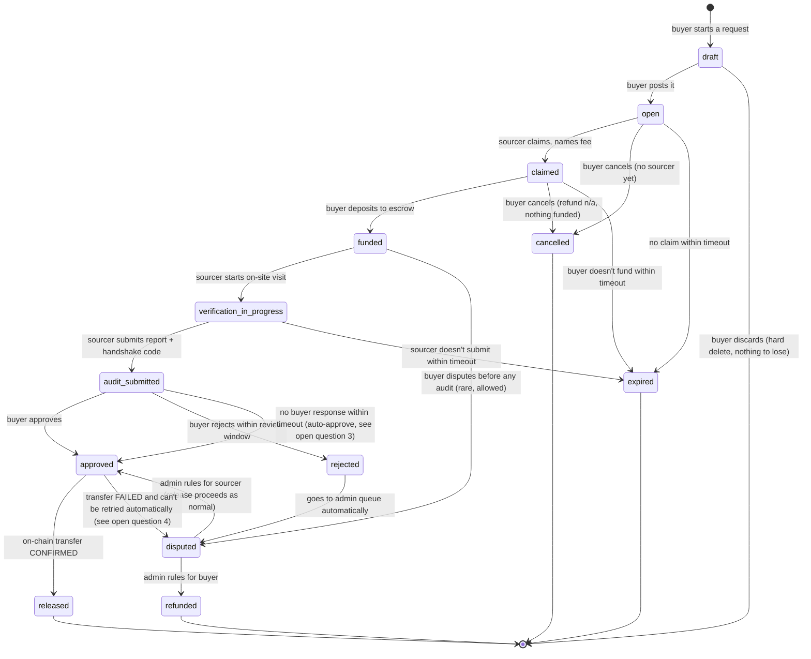

# Stage 6 — Escrow lifecycle design

Status: **draft, awaiting approval.** Per the prompt pack's own instruction
("write the state machine as a document and wait for my approval") and
CLAUDE.md's engineering rules ("if a task touches escrow, KYC, or payouts,
stop and flag it for human review rather than guessing at the rules"), no
implementation code has been written for this stage yet. This document is
the thing to review, question, and either approve or send back.

This isn't a clean-slate design — it starts from what `app/api/escrow/route.ts`
and `lib/requestStateMachine.ts` actually do today, and the real, verified
behavior of the Circle SDK version in `node_modules` (checked against its
`.d.ts` files directly, not assumed from docs — the same way the existing
`amounts` vs `amount` bug was originally found).

---

## 1. What actually changes, and why it's bigger than a rename

The prompt pack's target state list is:

```
draft → open → claimed → funded → verification_in_progress →
audit_submitted → approved → released
                        ↘ rejected → disputed → refunded
                                            ↘ (ruled for sourcer) → released
cancelled, expired (from open/claimed)
```

Today's `lib/requestStateMachine.ts` has eight states: `open`, `claimed`,
`escrow`, `verified`, `escrow_released`, `disputed`, `cancelled`, `expired`.
The gap isn't cosmetic. Two real things force the extra granularity:

**1. Approval and release are not the same event, and treating them as one
is the actual bug.** Today, `releaseEscrow` does three things in a single
request: checks the buyer approved, fires the Circle transfer, and marks
the request `escrow_released` — all before the transfer has actually
confirmed on-chain.

I checked what Circle's SDK really returns (`CreateTransferTransactionForDeveloperResponseData`
in `node_modules/@circle-fin/developer-controlled-wallets/dist/types/clients/developer-controlled-wallets.d.ts`,
line 601): just `{ id: string; state: TransactionState }`. No `txHash`.
`TransactionState` is `INITIATED | PENDING_RISK_SCREENING | QUEUED | SENT |
CONFIRMED | COMPLETE | CANCELLED | DENIED | FAILED` (line 577) — a transfer
is created, then moves through that pipeline asynchronously. The real
`txHash` only shows up later, as an optional field on the full `Transaction`
object (line 2478), fetched via `getTransaction({ id })` — a separate call,
after the fact.

So today's code doesn't just have a wrong-field-name bug (`amounts` instead
of `amount`, still confirmed present at line 245 of `developer-controlled-wallets.d.ts`
— it really is `amount: string[]`, an array, just singular). It has a
correctness bug underneath that: **it can't get a real txHash synchronously
no matter what field names are fixed**, because the transfer hasn't
happened yet at the point the code currently commits to `escrow_released`.
This is exactly what `approved` (buyer signed off, transfer submitted) vs
`released` (transfer confirmed, real txHash on file) are for. The richer
state list isn't extra ceremony — it's the only way to model what Circle
actually does.

**2. Verification currently has no "in progress" state at all.** A sourcer
who's started a site visit and a sourcer who's about to submit are
indistinguishable today — both just show `escrow`. `verification_in_progress`
vs `audit_submitted` gives the buyer something real to see mid-visit,
and gives Stage 7's collusion checks (GPS/EXIF, handshake code) a state to
attach the "in progress" window to.

**Also new:** `refunded` (nothing currently returns money to a buyer —
`disputed` is a dead end today, no route transitions into or out of it),
`rejected` (buyer disputing an audit specifically, distinct from a general
dispute filed later), and `draft` (see open question 1 — not free, has a
real UX cost, needs a decision).

---

## 2. Proposed state machine



### 2.1 Transition table

| From → To | Who triggers | Preconditions | Fund effect | Logged | Notification |
|---|---|---|---|---|---|
| `draft` → `open` | buyer | own draft, required fields present | none | audit_log: `request_posted` | none (buyer's own action) |
| `open` → `claimed` | sourcer | request still `open` (CAS), sourcer names a fee | none | audit_log: `request_claimed` | buyer: "A sourcer claimed your request" |
| `open`/`claimed` → `cancelled` | buyer | owns request, no funds moved yet | none | audit_log: `request_cancelled` | sourcer (if claimed): "Buyer cancelled" |
| `open`/`claimed` → `expired` | system (cron/cleanup) | timeout elapsed, no claim/fund | none | audit_log: `request_expired` | buyer: "Your request expired unclaimed" |
| `claimed` → `funded` | buyer | owns request, `claimed`, on-chain deposit confirmed | ledger: debit `ESCROW_WALLET` +total, credit `EXTERNAL` +total | audit_log: `escrow_funded`, `escrow_transactions` row | sourcer: "Escrow funded, you can start" |
| `funded` → `verification_in_progress` | sourcer | assigned sourcer, `funded` | none | audit_log: `verification_started` | buyer: "Sourcer started on-site verification" |
| `verification_in_progress` → `audit_submitted` | sourcer | assigned sourcer, handshake code correct (Stage 7), GPS/EXIF valid (Stage 7) | none | `audit_reports` row, audit_log: `audit_submitted` | buyer: "Audit ready for your review" |
| `audit_submitted` → `approved` | buyer (or system on timeout — see open question 3) | owns request, `audit_submitted` | none yet — release is the next step, not this one | audit_log: `audit_approved` | sourcer: "Buyer approved, payout incoming" |
| `audit_submitted` → `rejected` | buyer | owns request, within review window, reason required | none | audit_log: `audit_rejected`, `disputes` row created | sourcer + admin: "Audit rejected, under review" |
| `approved` → `released` | system, after Circle confirms | `approved`, Circle transfer state reaches `CONFIRMED`/`COMPLETE` | ledger: debit `ESCROW_WALLET` −fee, credit `SOURCER_PAYABLE:{id}` +fee; debit `ESCROW_WALLET` −platform_fee, credit `PLATFORM_REVENUE` +platform_fee | `escrow_transactions` row with real `txHash`, audit_log: `escrow_released` | both parties: "Funds released" |
| `rejected` → `disputed` | system (automatic) | — | funds frozen (no transition out except admin ruling) | audit_log: `dispute_opened` | admin: new item in review queue |
| `disputed` → `refunded` | admin | ruling recorded with reasoning | ledger: debit `ESCROW_WALLET` −total, credit `EXTERNAL` +total (back to buyer) | `escrow_transactions` row (type `refund`), audit_log: `dispute_resolved_buyer` | both parties |
| `disputed` → `approved` | admin | ruling recorded with reasoning | none (falls through to normal release) | audit_log: `dispute_resolved_sourcer` | both parties |

Every "who triggers" is still `requireRole()`-checked server-side, same
pattern as today — this table is documentation of intent, not a substitute
for the code doing the check.

---

## 3. Double-entry ledger

`escrow_transactions` today is a flat append-only log — one row per event,
no accounting invariant. The pack's requirement ("must balance to zero at
all times, with a test that asserts it") needs a real double-entry shape.

Proposed new table, additive (existing `escrow_transactions` stays as the
human-readable log; this is the invariant-checked layer underneath it):

```sql
create table ledger_entries (
  id bigint generated always as identity primary key,
  ledger_transaction_id uuid not null,  -- groups entries that must net to zero
  sourcing_request_id bigint not null references sourcing_requests(id),
  account text not null check (account in
    ('ESCROW_WALLET', 'PLATFORM_REVENUE', 'SOURCER_PAYABLE', 'EXTERNAL')),
  account_ref bigint references users(id),  -- set for SOURCER_PAYABLE only
  direction text not null check (direction in ('debit', 'credit')),
  amount_minor bigint not null check (amount_minor > 0),
  currency text not null default 'USD',
  created_at timestamptz not null default now()
);

create index idx_ledger_entries_txn on ledger_entries (ledger_transaction_id);
create index idx_ledger_entries_request on ledger_entries (sourcing_request_id);
```

`EXTERNAL` is the contra-account for money crossing the boundary of what
this ledger tracks (the buyer's own on-chain wallet, outside our system) —
every deposit and refund has one leg touching `EXTERNAL` so the ledger
always nets to zero without pretending to track money we don't custody.

**Invariant, and the test that proves it:** for any `ledger_transaction_id`,
`sum(amount_minor where direction='debit') = sum(amount_minor where
direction='credit')`. A Postgres trigger enforces this at insert time (reject
an unbalanced transaction outright, not just detect it later), and
`tests/ledger.test.ts` asserts it holds across the full happy-path and
every rejection/dispute/refund scenario, per the pack's requirement.

**What this deliberately leaves alone:** `ESCROW_WALLET`'s ledger balance
is bookkeeping, not custody — reconciling it against the actual on-chain
balance in `ESCROW_WALLET_ID` is a periodic job, not built here. Flagging
that as real scope, not an oversight.

---

## 4. Idempotency

Two layers, matching what's verified real in the Circle SDK:

1. **Circle's own `idempotencyKey`** (`WithIdempotencyKey`, a real required
   field on `CreateTransferTransactionInput` — confirmed in the `.d.ts`,
   not assumed) — generate one deterministically from
   `` `release:${sourcing_request_id}` `` so a retried release request
   (network flake, client double-click, our own retry after a timeout)
   can't create two on-chain transfers. Also set `refId` to the same value
   — a real, optional, client-supplied field Circle stores on the
   transaction — for reconciliation without needing our own mapping table.

2. **A DB-level backstop**, independent of Circle cooperating: a partial
   unique index — `create unique index on escrow_transactions
   (sourcing_request_id, type) where type = 'release'` — so even if the
   idempotency key were somehow bypassed, a second release row for the
   same request can't be written. Same pattern as `sourcer_applications`'
   one-pending-per-user index from the last stage.

The existing compare-and-swap (`.eq("status", from)`) still does the same
job it does today for every non-Circle transition — this section is only
about the one action (release) that also crosses an external, asynchronous
API.

---

## 5. Confirming the release (the actual state → released transition)

Since `createTransaction` only returns `{id, state}`, not a confirmed
`txHash`, `approved → released` can't happen inside the same request that
calls `createTransaction`. Two ways to do it, need a decision (open
question 4):

- **Poll**: after firing the transfer, a background job (cron / Vercel
  scheduled function) calls `getTransaction({id})` every N seconds until
  `state` is `CONFIRMED`/`COMPLETE` (write the real `txHash` then) or
  `FAILED`/`CANCELLED`/`DENIED` (transition to `disputed` for admin
  attention instead of silently stuck).
- **Webhook**: Circle supports transaction-state webhooks; nothing in this
  codebase currently has a webhook endpoint for Circle (checked — the only
  webhook-related code present is Privy's own, unrelated). Faster and
  cheaper than polling, but more infra to stand up correctly (signature
  verification, retries, an endpoint that's safe to call twice).

My default recommendation is polling for this stage — simpler, no new
public endpoint to secure, "good enough" for MVP volume — with a note that
a webhook is the natural upgrade once volume justifies it. Flagging as a
decision, not deciding it here.

---

## 6. Open questions — need your answer before I write code

1. **Is `draft` actually wanted?** Nothing in the current UI has a
   draft/publish split — "New request" posts directly to `open`. Adding
   `draft` is a real UX change (a two-step post flow), not just a schema
   addition. If you don't want that UX change yet, I'd drop `draft` from
   this stage and keep `open` as the initial state, revisiting later.
2. **What happens to the $5 platform fee on a refund?** Today it's
   deposited into escrow alongside the sourcing fee but never explicitly
   accounted for on release (it just stays in the escrow wallet — see the
   Ledger section). On a full refund, does the platform keep it, or does
   the buyer get 100% back? This is a real business decision, not
   something I should default silently.
3. **Auto-approve timeout on `audit_submitted`**: how many days before an
   un-reviewed audit auto-approves? The pack requires *some* defined
   timeout outcome here so funds can't be strandable by inaction — I don't
   have a number to use.
4. **Timeout durations generally** — `open`→`expired`, `claimed`→`expired`,
   `verification_in_progress`→`expired`, the review window on
   `audit_submitted`→`rejected`. Placeholder numbers only if you'd rather I
   pick something reasonable and you adjust later than block on this.
5. **Poll vs. webhook for release confirmation** (Section 5).
6. **Admin's dispute ruling** — `disputed → approved` (ruled for sourcer)
   still calls the same async Circle release as a normal approval. Is a
   split ruling ("resolved_split" — already a valid `disputes.status`
   value in the Stage 5 schema) in scope for this stage, or Stage 8's
   fuller dispute-queue work? I'd lean Stage 8, since a split release is
   a materially different fund-movement case than the binary
   buyer/sourcer ledger design above.

---

## 7. Test plan (once approved)

Matching the pack's exact list:
- Happy path: `open` → `released`, ledger balances to zero throughout.
- Buyer rejects an audit → `disputed` → `refunded`, ledger balances.
- Sourcer abandons (never submits) → `verification_in_progress` → `expired`.
- Timeout at each waiting state, individually.
- Duplicate release requests (same idempotency key) → exactly one
  `escrow_transactions` release row, exactly one on-chain transfer.
- Concurrent approve-and-dispute racing on the same request — only one
  wins, proven with the existing compare-and-swap pattern plus the new
  unique index.
